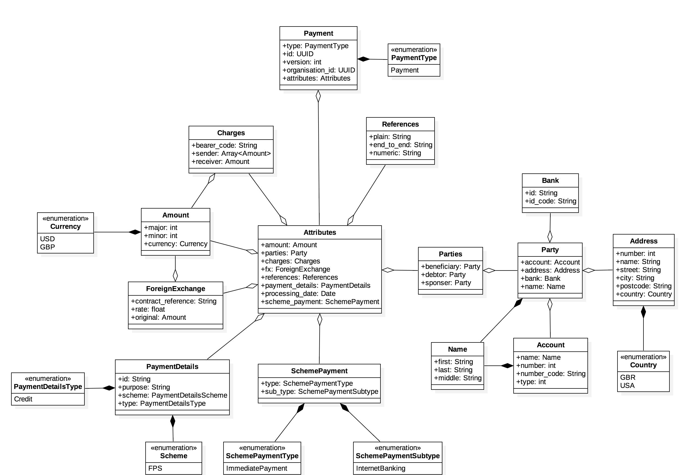

# Payments API

| Service | Status |
| --- | --- |
| Travis CI | [](https://travis-ci.org/kwyse/payments-api) |
| Codecov | [](https://codecov.io/gh/kwyse/payments-api) |
| Codebeat | [](https://codebeat.co/projects/github-com-kwyse-payments-api-master) |

## Getting Started

The project runs against Gradle 4.6 and JDK 10.

```bash
# To build and run the tests
$ gradle build

# To launch the server locally
$ java -jar build/libs/payments-api.jar
```

## Design

This was the original design of the system. The current implementation closely
matches this, but some abstractions are still to be done like a separate
`Address` entity.



There is also the [API specification](http://htmlpreview.github.io/?https://github.com/kwyse/payments-api/blob/master/api_specification.html).
The current implementation also closely matches this, but needs a more
enhancements such as returned JSON payloads.

## Assumptions

### Payment updates supply the full Payment object

Ideally, payments updates could be more granular, but this is dependent on
business logic. For example, it may be the case that the `payment_purpose` will
be frequently updated, so the API should be build around supplying just this
one field to a `PATCH` handler.

### Nested resources aren't required

Currently there is only one resource, `/payments`, but multiple persisted
entities, like `Charges` and `Party`. These could also be exposed as resources,
either as new root resources (`/charges` and `/parties`) or nested under
`/payments` (`/payments/{paymentId}/charges` and `/payments/{paymentId}/parties`).
The API can be easily extended to support either of these approaches.

### Resources will only be queried with their IDs

Query parameters could be added to support more complex querying and filtering,
but each supported parameter will need a corresponding database index. Fields
with indexes have an overhead when persisting them, so they should be limited
to fields that actually need to be queried in this manner. Only entity IDs have
been implemented to fit this criteria, but the API can be extended to support
more.

### Future enhancements

Error handling can be improved. Much has been left to Spring's default error
handling. The chosen approach would depend on how consumers of the API behave.